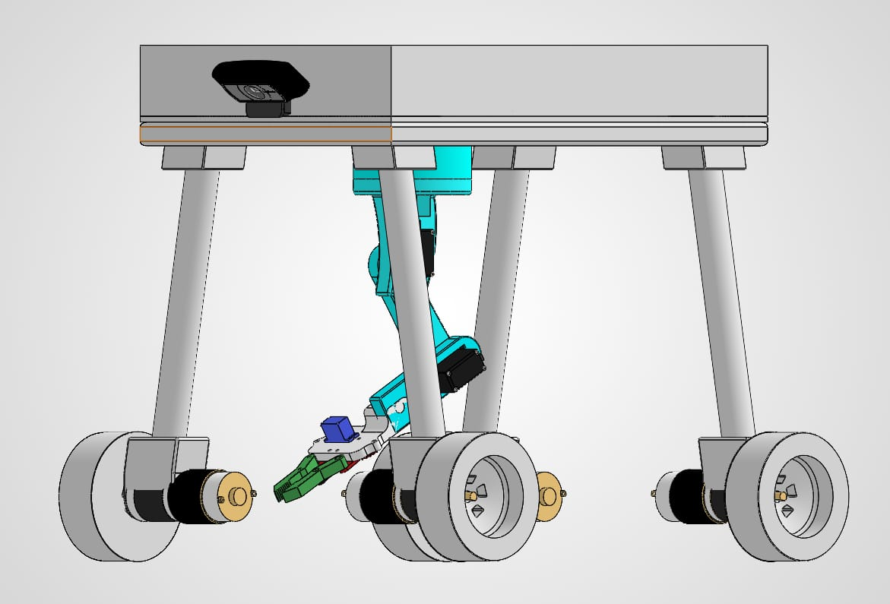
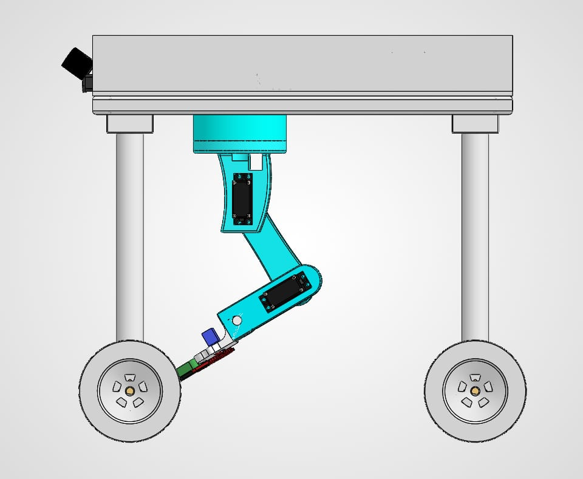
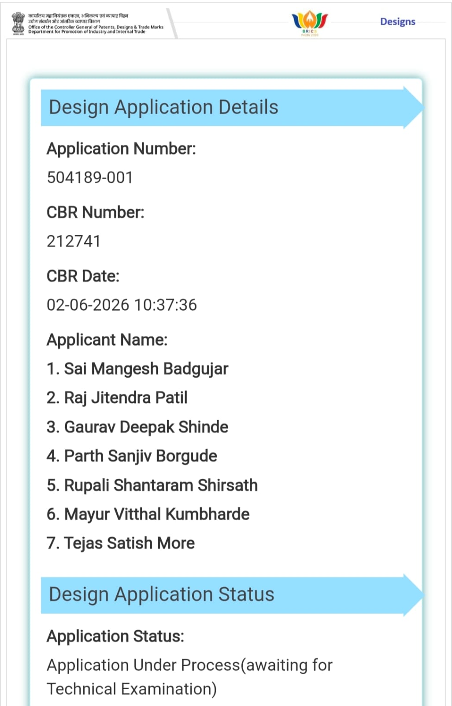

# WeedBot Flask App

WeedBot is a Raspberry Pi / Arduino-based weed detection and removal robot. This repository provides a Flask backend that streams camera video, performs ONNX-based weed detection, controls motors and servos, and exposes a simple web API for manual and autonomous operation.

## Features
- Live MJPEG video stream from connected camera
- ONNX-based weed detection
- Manual motor control via HTTP API
- Servo / arm control for weed targeting
- Auto mode that tracks weeds and positions the arm
- Arduino interface for motor/arm commands

## Prerequisites
- Python 3.8+ on Raspberry Pi or compatible Linux machine
- Raspberry Pi camera or USB webcam
- Arduino Mega 2560 running `ArduinoControl.ino`
- `weed_detector.onnx` model file present in repository

## Install
1. Create Python virtual environment (recommended):
   ```powershell
   python -m venv venv
   .\venv\Scripts\activate
   ```
2. Install dependencies:
   ```powershell
   pip install -r requirements.txt
   ```

## Run
```powershell
python app.py
```

The Flask server will start on `http://0.0.0.0:5000`.

## API Endpoints
- `GET /video_feed` - MJPEG video stream
- `POST /move` - move the robot wheels
  - Example body: `{"direction":"forward", "speed":80}`
- `POST /servo` - control arm servos
  - Example body: `{"servo_id":0, "angle":90}`
- `POST /mode` or `POST /auto` - toggle auto/manual mode
  - Optional body: `{"mode":"auto"}` or `{"mode":"manual"}`
- `POST /toggle_detect` - enable/disable detection
  - Example body: `{"enabled": false}`
- `GET /status` - current robot state
- `GET /heartbeat` - health check

## Configuration
- `utils.py` contains GPIO pin definitions and camera source settings.
- The app auto-detects Arduino serial port, but Windows fallback is `COM3` and Linux fallback is `/dev/ttyACM0`.

## Hardware Notes
- Ensure the Arduino is connected via USB and running the `ArduinoControl.ino` sketch.
- Connect camera and motors with the proper GPIO pins defined in `utils.py`.
- On development systems without Raspberry Pi GPIO, `mock_gpio.py` is used.

## Hardware Design & Patent
This project includes hardware design references for the WeedBot robot. The design files below show the mechanical layout, camera placement, motor wiring, and arm assembly.







> Patent: This design is intended for use in developing a utility and design patent application for an autonomous weed-removal robot. The included images demonstrate the overall layout and hardware arrangement used in the project.

## Repository Structure
- `app.py` - main Flask application
- `ArduinoControl.ino` - Arduino sketch for motor and arm control
- `arm.py` - robotic arm control logic
- `camera.py` - camera capture and frame streaming
- `motor.py` - motor control logic
- `weed_detector.py` - weed detection and annotation
- `utils.py` - GPIO and serial helpers
- `api_documentation.md` - API endpoint details

## Notes
- The backend is designed to run in threaded mode for camera streaming and detection.
- If the Arduino is not available, serial commands are mocked and motors will not move.
